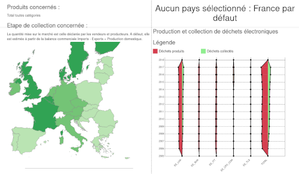

# Gestion européenne des déchets électroniques

## Résumé

Nous nous sommes intéressé à la production de déchets électroniques. Ce sujet nous tient à coeur car il nous touche tous en tant que consommateurs, et en tant que citoyens. Nous avons créé des éléments de visualisation de ce phénomène, et un site autour en trois pages :

 - Page d'introduction qui situe le problème (pourquoi ce choix de sujet, quels sont les enjeux), et situe la production de l'UE dans celle du monde.
 - Visualisation principale :
   - Une carte de l'Europe interactive, affichant en couleur les quantités de déchets électroniques pour chaque pays
   - Un histogramme représantant l'évolution du total européen du volume de déchets
   - Un diagramme comparant pour un pays donné les quantités produites et collectées, pour chaque catégorie de déchet. Le pays est sélectionnable via la carte.
   - Un histogramme comparant pour chaque pays les quantités produites de déchets pour une année donnée
   - Un sélecteur d'année qui modifie les données affichées sur la carte et le deuxième histogramme
   - Un sélecteur de type de déchets qui modifie la carte et le premier histogramme
   - Un sélecteur de l'étape de traitement du déchet (produit, collecté, recyclé) qui modifie la carte et le premier histogramme
   - Une notice explicative précisant à quoi correspondent le type et l'étape sélectionnés.
 - Page About, précisant le cadre du projet, les auteurs du site et les sources des données.

## English summary

We were interested in exploring the production of electronic waste (WEEE) in Europe. This thematic is one that echoes with us, as consummers, and citizens of the EU. We have created a few elements of visualisation, to describe in depth the statistics known on this phenonmenon. To achieve this, we have created a three pages website.

It consists in:
 - An introductory webpage that explains why the thematic is important and why we choose it, and helps contextualize the EU in the global flows of e-waste.
 - The main visualization, in the form of a dashboard:
   - An interactive map of the EU, displaying in color scale the quantity of e-waste per country.
   - A histogram showing the evolution of the total over the EU of the volume of waste
   - A diagram comparing for a given country the quantity of waste produced and collected for each type of e-waste. The country can be selected by left-clicking on the particular country on the map.
   - A histogram comparing for a given country the quantities produced for each category, for a given year.
   - A year selector, changing the map and second histogram to display the selected year.
   - A waste category selector, changing the map and the first histogram
   - A waste disposal step selector (production, collection, recycling), changing the map and the first histogram
   - An explanation of what the selected category and disposal step correspond to.
 - About page, linking to the course and Master webpage, giving the sources of the data, and with our names.
 
## Thumbnail

